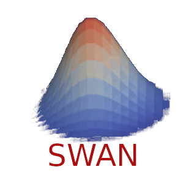

&nbsp;&nbsp;&nbsp;

Le code *swan* est le résultat d'un stage de M1 réalisé au [CEA](https://www.cea.fr/).

L'objectif était de réaliser un code de simulation de propagation d'ondes dans l'environnement [NabLab](https://github.com/cea-hpc/NabLab).

La documentation du code est accessible [ici](https://cea-hpc.github.io/swan/).

