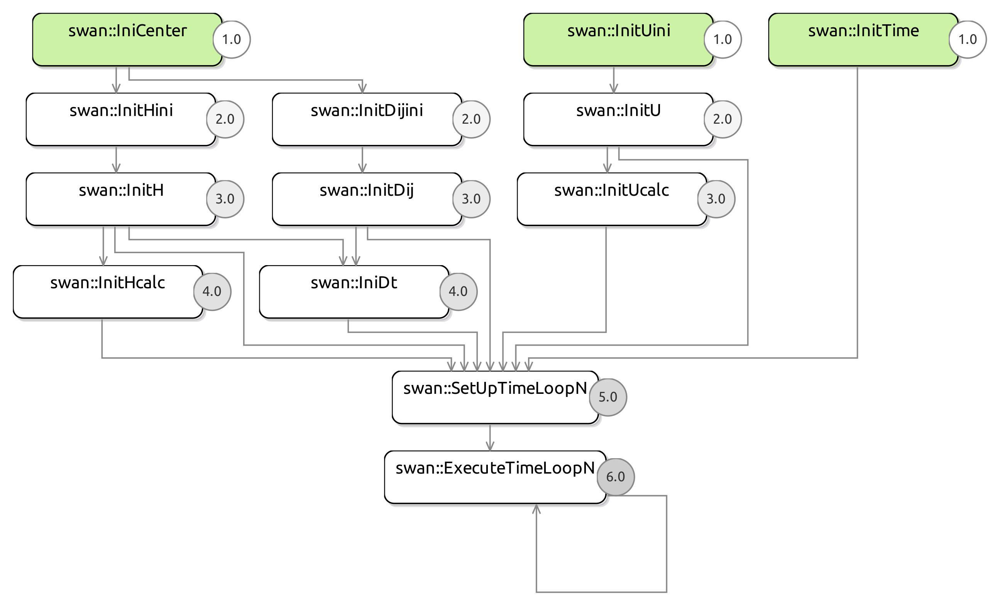
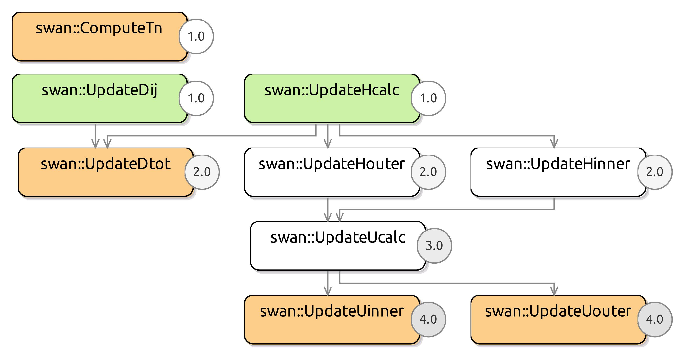
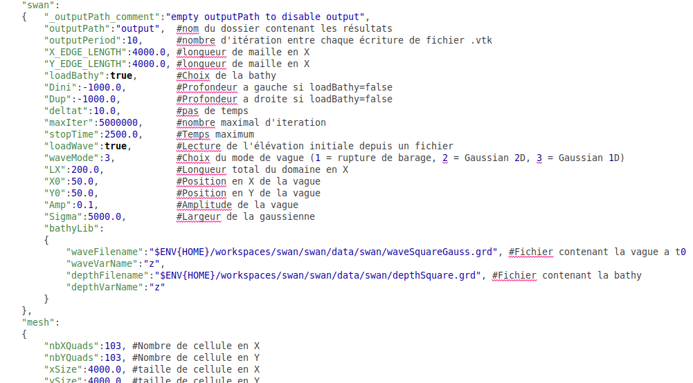

# Le code SWAN

## Présentation

Cette documentation a pour objectif de permettre une bonne compréhension du code *swan* développé en langage [NabLab](https://github.com/cea-hpc/NabLab). 
Elle doit permettre également de faciliter l'utilisation et la modification de celui-ci.

Le code *swan* est le résultat d'un stage de M1 réalisé au [CEA](https://www.cea.fr/).

## Le problème physique

Le code de simulation de propagation d'ondes *swan* est basé sur des équations [SHALLOW WATER](https://en.wikipedia.org/wiki/Shallow_water_equations).

Le modèle utilisé est tiré du chapitre 2 du livre intitulé [NUMERICAL MODELING OF WATER WAVES](https://books.google.fr/books?id=1UGcWQFn0lsC&printsec=frontcover&hl=fr#v=onepage&q&f=false) de Charles L. Mader.

Le lecteur intéressé peut lire ce chapitre afin de comprendre le raisonnement menant au système d'équations aux dérivées partielles suivant :

$$
\begin{align}
\frac{\partial U_x}{\partial t} + U_x \frac{\partial U_x}{\partial x} + U_y \frac{\partial U_x}{\partial y} + g \frac{\partial H}{\partial x} = 0
\end{align}
$$

$$
\begin{align}
\frac{\partial U_y}{\partial t} + U_x \frac{\partial U_y}{\partial x} + U_y \frac{\partial U_y}{\partial y} + g \frac{\partial H}{\partial y} = 0
\end{align}
$$

$$
\begin{align}
\frac{\partial H}{\partial t} + \frac{\partial (D+H)U_x}{\partial x} + \frac{\partial (D+H)U_y}{\partial y}  = 0
\end{align}
$$

$U_x$ : vitesse dans la direction x (indice i), $U_x$ devient $U$ dans les équations discrétisées 
$U_y$ : vitesse dans la direction y (indice j), $U_y$ devient $V$ dans les équations discrétisées 
$g$   : accélération de la gravité ($-9.8$ $m.s^{-2}$) 
$t$   : temps 
$H$   : hauteur d'eau au dessus de la surface au repos 
$D$   : profondeur 

## Le schéma numérique

Vous trouverez ci-dessous le schéma numérique implémenté, ainsi qu'une illustration d'une maille. 
Cette dernière montre comment sont organisées les données sur le maillage.

$$
\begin{align}
H^{n+1}_{i,j} = H^n_{i,j} - \Delta t \Biggl[ \frac{U^n_{i+1,j}}{\Delta x}(TD1) - \frac{U^n_{i,j}}{\Delta x}(TD2) +  \frac{V^n_{i,j+1}}{\Delta y}(TV1) -  \frac{V^n_{i,j}}{\Delta y}(TV2)\Biggr] 
\end{align}
$$

$$
\begin{align}
TD1 &amp = D_{i+1,j} + H^n_{i+1,j}  &amp (U^n_{i+1,j} \lt 0) \\
TD1 &amp = D_{i,j}   + H^n_{i,j}    &amp (U^n_{i+1,j} \gt 0) \\
TD2 &amp = D_{i,j}   + H^n_{i,j}    &amp (U^n_{i,j} \lt 0) \\
TD2 &amp = D_{i-1,j}   + H^n_{i-1,j}    &amp (U^n_{i,j} \gt 0) \\
TV1 &amp = D_{i,j+1}   + H^n_{i,j+1}    &amp (V^n_{i,j+1} \lt 0) \\
TV1 &amp = D_{i,j}   + H^n_{i,j}    &amp (V^n_{i,j+1} \gt 0) \\
TV2 &amp = D_{i,j}   + H^n_{i,j}   &amp (V^n_{i,j} \lt 0) \\
TV2 &amp = D_{i,j-1}   + H^n_{i,j-1}    &amp (V^n_{i,j} \gt 0) \\
\end{align}
$$

$$
\begin{align}
U^{n+1}_{i,j} = U^n_{i,j} - \Delta t \Biggl[\frac{U^n_{i,j}}{\Delta x}(TU1) + \frac{TV}{\Delta y}(TU2)\Biggr] - g \frac{\Delta t}{\Delta x}\Bigl[THU\Bigr]
\end{align}
$$

$$
\begin{align}
TV  &amp = 0.25 * (V^n_{i,j} + V^n_{i,j+1} + V^n_{i-1,j+1} + V^n_{i-1,j} )  \\
TU1 &amp = U^n_{i+1,j} - U^n_{i,j} &amp (U^n_{i,j} \lt 0)\\
TU1 &amp = U^n_{i,j}   - U^n_{i-1,j} &amp (U^n_{i,j} \gt 0)\\
TU2 &amp = U^n_{i,j+1} - U^n_{i,j} &amp (TV \lt 0)\\
TU2 &amp = U^n_{i,j}   - U^n_{i,j-1} &amp (TV \gt 0)\\
THU &amp = H^n_{i,j}   - H^n_{i,j-1} &amp \\
\end{align}
$$

$$
\begin{align}
V^{n+1}_{i,j} = V^n_{i,j} - \Delta t \Biggl[\frac{TU}{\Delta x}(TV1) + \frac{V^n_{i,j}}{\Delta y}(TV2)\Biggr] - g \frac{\Delta t}{\Delta y}\Bigl[THV\Bigr]
\end{align}
$$

$$
\begin{align}
TU  &amp = 0.25 * (U^n_{i,j} + U^n_{i,j+1} + U^n_{i-1,j+1} + U^n_{i-1,j} )  \\
TV1 &amp = V^n_{i+1,j} - V^n_{i,j} &amp (U^n_{i,j} \lt 0)\\
TV1 &amp = V^n_{i,j}   - V^n_{i-1,j} &amp (U^n_{i,j} \gt 0)\\
TV2 &amp = V^n_{i,j+1} - V^n_{i,j} &amp (TV \lt 0)\\
TV2 &amp = V^n_{i,j}   - V^n_{i,j-1} &amp (TV \gt 0)\\
THV &amp = H^n_{i,j}   - H^n_{i,j-1} &amp \\
\end{align}
$$

## Le graphe du programme

ExecuteTimeLoopN correspond au graphe suivant

## La bibliothèque BathyLib

Comme dans beaucoup de programme, l'initialisation des variables nécessaires à la simulation requiert la lecture de données depuis des fichiers.
Dans notre cas, nous sommes amenés à lire des fichiers avec extension *.nc* ou *.grd*, qui sont des fichiers au format [NetCDF](https://www.unidata.ucar.edu/software/netcdf/docs/index.html).
Il est possible d'inspecter manuellement le contenu d'un fichier en utilisant le programme *ncdump* ou d'utiliser une librairie afin d'extraire les données.
C'est cette dernière possibilité qu'utilise notre code.

Ci-dessous une image montrant l'organisation des données au sein d'un fichier .grd.

Les fonctions de lecture de fichiers *.grd* se trouvent dans l'extension NabLab nommée *BathyLib*.
Pour comprendre comment fonctionne cette extension, consultez la documentation [NabLab](https://cea-hpc.github.io/NabLab/firstextension).
La seule différence est que dans le tutoriel NabLab, l'extension est un projet externe alors que dans le code *swan* c'est simplement un sous-répertoire de *src*.

Les fonctions de BathyLib s'exécutent obligatoirement de manière séquentielle (toutes les fonctions externes de NabLab). 
Dans le cas du code SWAN, les fonctions sont toutes des fonctions de lecture de fichier.

Les fichiers *.grd* sont utilisés pour initialiser les variables vivant sur les mailles (H, D, R, latitude, longitude).
Lorsque l'utilisateur écrit quelque chose comme $\forall ic \in innerCells()$ dans un fichier source NabLab (fichier *.n*), 
cela sera traduit en une boucle sur toutes les *innerCells*. L'ordre de parcours des mailles se fait ligne par ligne, du bas vers le haut. 
Les valeurs des grandeurs d'intérêt stockées dans les fichiers sont ordonnées de la même façon. 
Les fonctions de lecture ne font donc que récupérer les données dans un tableau, puis renvoient les valeurs une par une.
À chaque appel, un compteur, qui est l'indice de la prochaine valeur à renvoyer, est incrémenté.
Dans le cas des longitudes et latitudes, leur fonction externe respective doit procéder à une étape supplémentaire entre la lecture et la création du tableau de données.
Cette dernière information n'intéressera que les personnes voulant comprendre le code des fonctions externes ou voulant modifier ces dernières.

Un utilisateur doit seulement retenir que les variables stockées sur chaque maille se remplissent ligne par ligne, du bas vers le haut.

Il doit également se souvenir que le maillage utilisé contient un "bord artificiel" servant à imposer des conditions au bord.
Les fichiers *.grd* contiennent uniquement les valeurs des *innerCells*. 
Nous verrons par la suite que la taille du maillage est donnée au programme par un fichier de données utilisateur.
Cette taille prend en compte le bord artificiel.

Ci-dessous une illustration expliquant comment la librairie NetCDF est utilisée dans le code des fonctions externes.

## Les singletons

Vous remarquez que le code comporte beaucoup de $\forall qqchose \in unensemble$. 
Ces expressions sont généralement transcrites comme des boucles sur chacun des éléments de `unensemble`.
Dans notre cas, il faut voir ça uniquement comme un point de syntaxe à connaitre.
En effet, dans le code SWAN, les ensembles sont souvent des singletons.
Nous pouvons donc voir ces expressions comme des définitions.
Par exemple $\forall rc \in rightCell(c)$ peut être vu comme: "soit rc la cellule à droite de c" car `rightCell(c)` est un singleton. 

## L'initialisation des variables

Lors de la lecture du code, vous remarquerez que l'initialisation se fait à l'aide d'une "astuce". 
En effet, souvenons nous que nous avons autour du vrai maillage, un "bord artificiel". 
Celui-ci est constitué de mailles et de faces que l'on doit mettre à jour à chaque pas de temps.
Chaque maille et face du bord du maillage, va être initialisée en allant chercher les valeurs de son plus proche voisin contenu dans le "vrai" maillage.

Il n'est pas possible d'imposer d'ordonnancement avec le langage NabLab: par exemple initialiser d'abord l'intérieur, puis les bords au temps t=0. 
Nous devons donc utiliser deux variables, H et Hini afin d'initialiser, au temps $t_0$, la variable H.
Nous remplissons d'abord l'intérieur du maillage à l'aide de Hini, puis nous clonons les valeurs sur le bord, avant de recopier dans H, les valeurs de Hini.
Si nous ne faisons pas cela, NabLab va détecter un cycle, et refusera de générer du code.

## Utilisation du programme

L'utilisation des programmes Swan et Swangeo est grandement simplifiés grâce aux capacités de NabLab.
Après compilation des sources, le programme s'exécute comme suit : `./swan path/to/options.json`

L'intégralité des informations à fournir au programme doit être écrite dans ce fichier d'options utilisateur au format [Json](https://www.json.org/json-en.html).
Nous allons détailler son contenu et expliquer brièvement le rôle de chacun des champs du fichier.

## Les problèmes d'affichage

Pour l'affichage des résultats nous utilison le logiciel [Paraview](https://www.paraview.org/).
Des problèmes d'affichage peuvent survenir. Généralement, cela signifie que les valeurs contenues dans les fichiers de résultats sont égales à Inf, nan, -nan, etc.
Lorsque cela se produit, Paraview peut soit afficher du jaune, soit ne plus rien afficher du tout, soit indiquer un message d'erreur comme "can't read value at ...". 
Cela se produit notamment si le pas de temps et le pas d'espace ne vérifient pas la condition CFL. 
Il vous faudra alors soit réduire le pas de temps de la simulation, soit augmenter les pas d'espace.

Nous tenons à faire remarquer que dans le cas du code SWAN, la condition CFL nous indique que le pas de temps doit vérifier : 

$$
C \frac{\delta t}{\delta x}<0.5
$$

Où C est la vitesse de l'onde ($C=\sqrt{g*d}$). Pour un pas $\delta x = 2000$ mètres, une profondeur de 1000m, $\delta t = 10s$ devrait être suffisant.

## La génération de code

L'environnement de développement NabLab, outre le fait de permettre l'édition d'un code source, permet de générer un code en langage généraliste, compilable ou interprétable.
Nous avons choisi comme cible de génération du code C++ multi-threads, parallélisme en mémoire partagée (cible `StlThread`). 
Ce choix s'effectue dans le fichier *.ngen*.

!!! note
	D'autres choix de génération sont possibles. Voir la [documentation NabLab](https://cea-hpc.github.io/NabLab/ngenlanguage/#configuring-generation) pour plus d'informations.

Dans ce projet, nous avons choisi d'utiliser cette cible de génération pour des raisons de portabilité. 
En effet, c'est le seul backend ne nécessitant pas d'installer de librairie externe.
Nous verrons dans la partie suivante, que nous avons tout de même utilisé du C++ Multithread Kokkos pour faire des tests de scalabilités.

